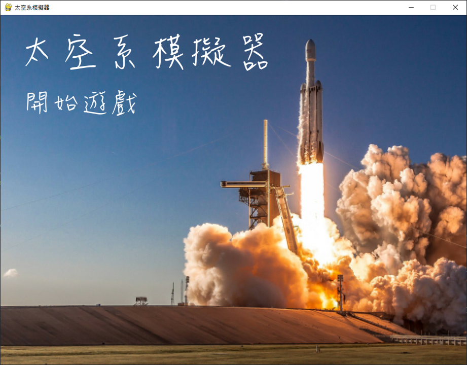

# Space_Simulation_Game
## 專案介紹
本專案由 4~5 人團隊開發完成，使用 Python 程式語言設計「太空系模擬器」遊戲，玩家將扮演即將就讀中央大學太空科學與工程學系的大一新生，體驗就讀太空系的四年大學經歷。 

## 專案技術
Python 3.9、PyGame 2.3.0

## 資料夾說明
* calender - 日曆圖片放置處
* Fight - 打工支線圖片放置處
* images - 背景圖片放置處
* musics - 音樂檔案放置處
* social - 社交支線圖片放置處
* txtimage - 文字選項外框圖片放置處

## 負責項目
部分主程式架構、社交支線設計

## 成果

